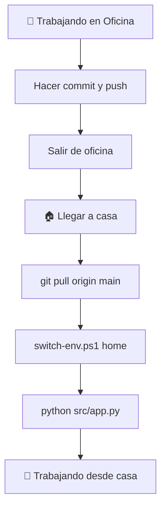

# 🏠 GUÍA: VOLVER A CASA DESPUÉS DE TRABAJAR EN LA OFICINA

## 🔄 **Proceso Completo: Oficina → Casa**

### 🏢 **ANTES DE SALIR DE LA OFICINA**

#### **1. Guardar todo el trabajo:**
```bash
# Verificar qué archivos han cambiado
git status

# Agregar todos los cambios
git add .

# Hacer commit con mensaje descriptivo
git commit -m "trabajo oficina: [resumen de lo que hiciste hoy]"

# Subir cambios al repositorio
git push origin main
```

#### **2. Verificar que todo está sincronizado:**
```bash
# Ver último commit
git log --oneline -5

# Verificar que no hay cambios pendientes
git status
# Debería mostrar: "nothing to commit, working tree clean"
```

#### **3. Opcional - Crear branch específico:**
```bash
# Si trabajaste en algo específico, crear branch
git checkout -b feature/trabajo-oficina-[fecha]
git push origin feature/trabajo-oficina-[fecha]
```

---

## 🏠 **AL LLEGAR A CASA**

### **Paso 1: Sincronizar cambios**
```bash
# Navegar a tu proyecto (si ya lo tienes)
cd C:\ruta\a\tu\InfoMilo

# Obtener todos los cambios de la oficina
git pull origin main
```

### **Paso 2: Cambiar a configuración de casa**
```bash
# Cambiar configuración usando script
.\scripts\switch-env.ps1 home

# O manualmente
copy config\home.json config\active.json
```

### **Paso 3: Activar entorno de desarrollo**
```bash
# Activar entorno virtual
.venv\Scripts\activate

# Verificar que las dependencias están actualizadas
pip install -r requirements.txt

# Iniciar aplicación en modo casa
python src\app.py
```

### **Paso 4: Verificar funcionamiento**
- **Abrir:** http://localhost:3000 (puerto de casa)
- **Verificar:** Debe mostrar "🏠 CASA" en la interfaz
- **Confirmar:** Debug habilitado, configuración de casa activa

---

## ⚡ **COMANDOS RÁPIDOS PARA CASA**

### **Rutina completa en 4 comandos:**
```bash
git pull origin main
.\scripts\switch-env.ps1 home  
.venv\Scripts\activate
python src\app.py
```

### **Verificación rápida:**
```bash
# Ver configuración activa
type config\active.json

# Debería mostrar:
# "environment": "home"
# "port": 3000
# "debug_mode": true
```

---

## 🔍 **DIFERENCIAS CASA vs OFICINA**

| Configuración | 🏢 Oficina | 🏠 Casa |
|---------------|------------|---------|
| **URL** | http://localhost:8080 | http://localhost:3000 |
| **Puerto** | 8080 | 3000 |
| **Host** | 0.0.0.0 | localhost |
| **Debug** | OFF (seguridad) | ON (desarrollo) |
| **Proxy** | Corporativo | No |
| **Backup** | Red corporativa | Cloud sync |
| **Git Email** | @empresa.com | personal |
| **Tema Editor** | Light | Dark |
| **VPN** | Requerida | Opcional |

---

## 🔄 **SINCRONIZACIÓN AUTOMÁTICA**

### **Script para cambio automático casa:**
Crear `scripts/switch-to-home.ps1`:

```powershell
Write-Host "🏠 Configurando para trabajo desde CASA..." -ForegroundColor Green

# Sincronizar cambios
Write-Host "📥 Obteniendo cambios de la oficina..." -ForegroundColor Yellow
git pull origin main

# Cambiar configuración
Write-Host "⚙️ Activando configuración de casa..." -ForegroundColor Yellow
Copy-Item -Path "config\home.json" -Destination "config\active.json" -Force

# Configurar Git personal
Write-Host "🔗 Configurando Git personal..." -ForegroundColor Yellow
git config user.email "tu.email@personal.com"

# Activar entorno
Write-Host "🐍 Preparando entorno Python..." -ForegroundColor Yellow
& .venv\Scripts\activate

Write-Host "✅ ¡Listo para trabajar desde casa!" -ForegroundColor Green
Write-Host "🚀 Ejecutar: python src\app.py" -ForegroundColor Cyan
Write-Host "🌐 URL: http://localhost:3000" -ForegroundColor Cyan
```

### **Usar el script:**
```bash
.\scripts\switch-to-home.ps1
python src\app.py
```

---

## 🚨 **PROBLEMAS COMUNES AL VOLVER A CASA**

### **❌ "Git conflicts" o errores de merge:**
```bash
# Si hay conflictos
git status
git diff

# Resolver conflictos manualmente o
git reset --hard origin/main  # ⚠️ Cuidado: borra cambios locales
```

### **❌ "Puerto 3000 ocupado":**
```bash
# Ver qué usa el puerto
netstat -ano | findstr :3000

# Cambiar puerto temporalmente en config/home.json
# O terminar el proceso que usa el puerto
```

### **❌ "Configuración no cambia":**
```bash
# Verificar que el archivo se copió
type config\active.json

# Forzar cambio manual si es necesario
copy config\home.json config\active.json /Y
```

### **❌ "Dependencias desactualizadas":**
```bash
# Reinstalar dependencias
pip install -r requirements.txt --upgrade

# O recrear entorno virtual si hay problemas
rmdir /s .venv
python -m venv .venv
.venv\Scripts\pip install -r requirements.txt
```

---

## 📱 **VERIFICACIÓN COMPLETA**

### **Todo funciona si:**
- [ ] ✅ `git status` muestra "working tree clean"
- [ ] ✅ `type config\active.json` muestra `"environment": "home"`
- [ ] ✅ http://localhost:3000 carga la aplicación
- [ ] ✅ La interfaz muestra "🏠 CASA"
- [ ] ✅ Debug está habilitado (ves logs detallados)
- [ ] ✅ No hay proxy configurado
- [ ] ✅ `git config user.email` muestra tu email personal

---

## 🔄 **FLUJO COMPLETO OFICINA → CASA**



---

## 🎯 **CHECKLIST RÁPIDO**

### **🏢 Antes de salir de oficina:**
- [ ] `git add . && git commit -m "trabajo oficina: resumen"`
- [ ] `git push origin main`
- [ ] `git status` (verificar limpio)

### **🏠 Al llegar a casa:**
- [ ] `git pull origin main`
- [ ] `.\scripts\switch-env.ps1 home`
- [ ] `.venv\Scripts\activate`
- [ ] `python src\app.py`
- [ ] Abrir http://localhost:3000
- [ ] Verificar que muestra "🏠 CASA"

---

## 💡 **TIPS PARA TRABAJO HÍBRIDO**

### **Mantener sincronización:**
- Hacer commits pequeños y frecuentes
- Push al final de cada día
- Pull al comenzar cada día
- Usar branches para features grandes

### **Configuraciones específicas:**
- Variables de entorno diferentes por ubicación
- Configuración de proxy automática
- Backup policies por entorno
- Git email automático por ubicación

### **Productividad:**
- Script único para cambio rápido
- Verificaciones automáticas
- URLs diferentes para evitar confusión
- Debug apropiado por entorno

---

¡Con este proceso podrás cambiar seamlessly entre oficina y casa manteniendo toda tu productividad! 🏠🏢✨
